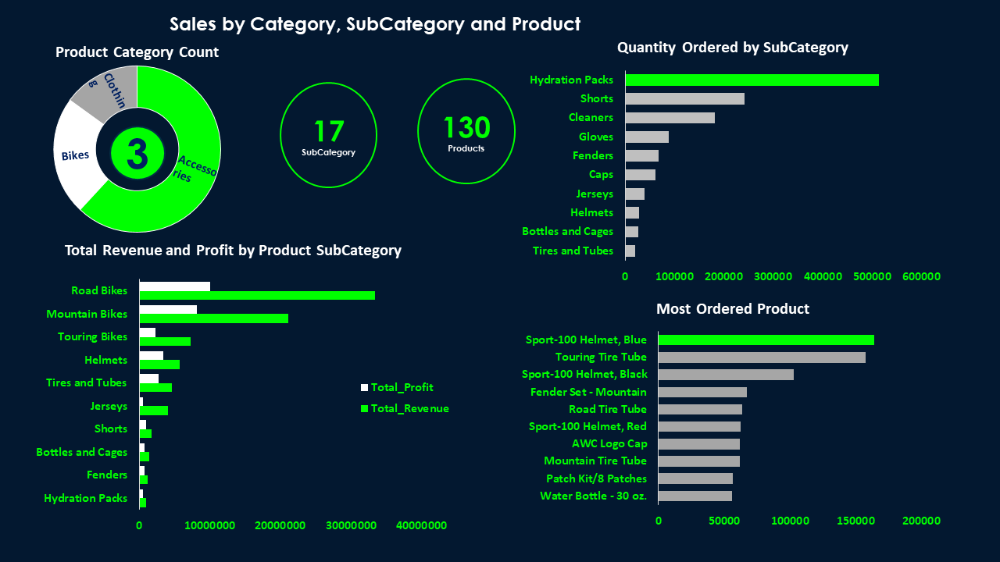

# Sales-Analysis-Using-MS-SQL-and-Visualization

## INTRODUCTION
I obtained this data from kaggle where I recently completed a data analysis project using SQL to examine the Sales dataset. The project involve the following steps:

## DATA PREPARATION/PROCESSING/ANALYSIS
-	Gaining a general understanding of the dataset by selecting the top 5 rows
-	Counting the number of orders and calculating the total revenue per country to identify the most profitable markets
-	Identifying the top selling product categories and products by order quantity
-	Calculating the average profit margin per order to assess overall profitability
-	Analyzing the revenue and profit for each sub-category to identify areas of strength and weakness
By performing these queries and analyzing the results, I was able to gain valuable insights into the dataset and provide actionable recommendations to stakeholders. I found that the top selling category is the Accessories, the most ordered sub category is the Hydration Packs but most revenue generated in the subcategory is from the Road Bikes and the most ordered product is the sport 100 Helmet Blue. I also discovered that the United States was the most profitable market, with over 33% of total revenue.
(The SQL Queries I ran be seen on the ‪sales_SQLQuery1.sql file of this sales repository)‬‬
I also perform further analysis using pivot table and application of some formulas to get more insight and understand other trends and patterns which I visualize
## DATA VISUALIZATION
Through this project, I demonstrated my ability to use SQL to extract meaningful insights from complex data sets, and my skills in data analysis, visualization, and communication.

Sales KPI and demographics

Sales by Location

Sales Category, SubCategory and Product

Sales by Time

## RECOMMENDATIONS
There is a 38% profit return! Based on my analysis, I would like to offer the following recommendations:

-	Focus on the bikes category: Since the highest profit and revenue is coming from the bikes category, it would be wise to allocate more resources towards this category. Keen attention should be on the road bikes which has the highest revenue and profit return

-	Increase promotion for hydration packs: Since the hydration packs have the highest order quantity, it would be a good idea to promote them more heavily on your website, social media, and email campaigns. You can also consider offering discounts or promotions to incentivize customers to purchase them.

-	Consider expanding the product line: With 130 products in your store, you have a good range of products to offer customers. However, it may be worth considering expanding your product line to attract new customers or appeal to existing customers who are interested in other types of products. Further analysis with focus on less patronize products should be check for rebranding to attract more customers or possible introduction of new product and discarding less profit generating one’s to create market or space

-	Capitalize on seasonal trends: Based on the time series analysis, December and June are the months with the most revenue generation and quantity ordered. You can take advantage of these trends by offering promotions or discounts during these months to incentivize customers to purchase more. Additionally, months with less orders or revenue generation such as july, august, and September need adjust on marketing strategies accordingly.
